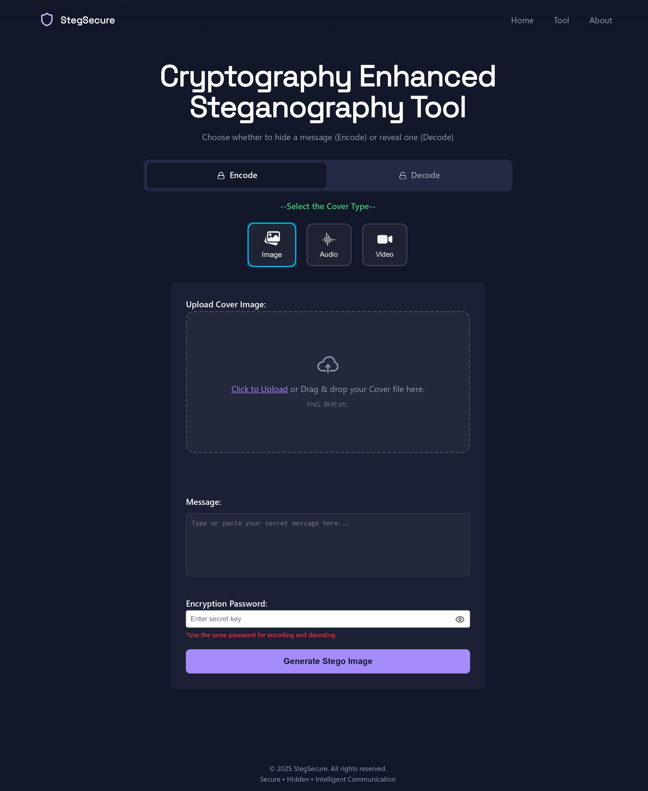
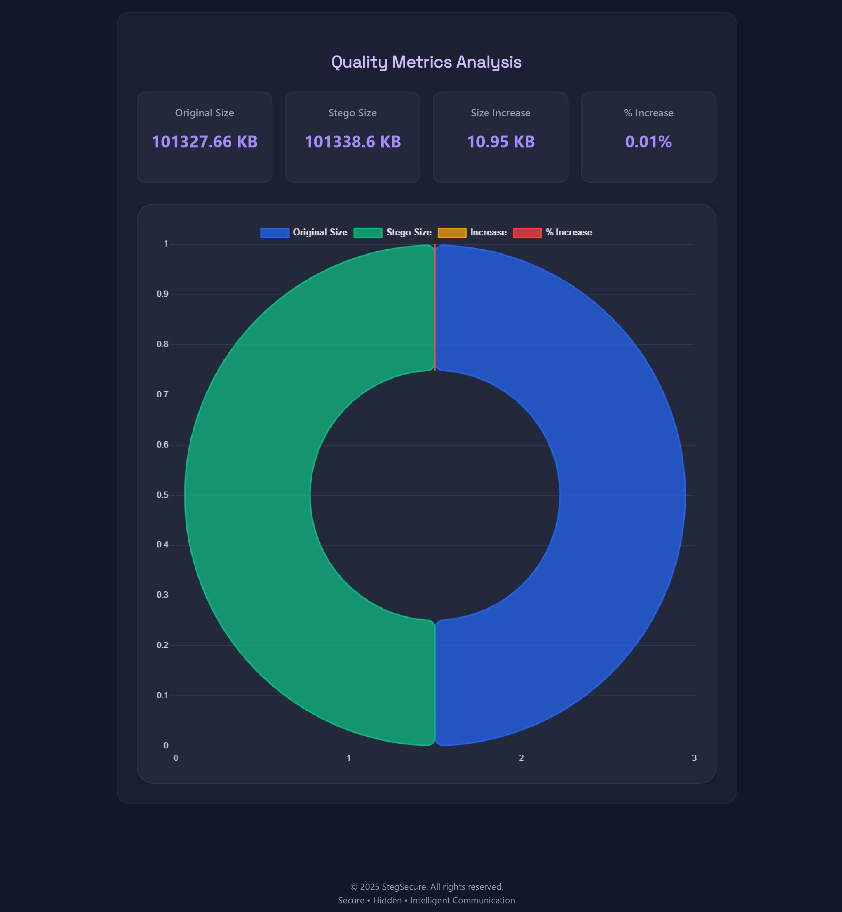

# StegSecure

StegSecure is a cybersecurity-focused steganography web application designed for secure hidden communication across multimedia formats using encryption, image processing and steganographic analysis techniques.

The application enables users to securely embed and extract hidden information inside images, audio and video files while also providing quality analysis metrics and visualization tools to evaluate steganographic impact.

<p align="center">
  
  
  
</p>

---

# Live Demo

```text
https://stegsecure.in
```

---

# Overview

StegSecure combines modern web technologies with cybersecurity concepts to create a practical platform for secure multimedia steganography.

The project focuses on:

- Secure hidden communication
- AES-256 encryption integration
- Multimedia steganography
- Image processing and analysis
- Steganographic quality evaluation
- Secure file handling workflows
- Cybersecurity-oriented application development

The platform is designed as both a practical utility and a portfolio-grade cybersecurity project demonstrating real-world implementation of encryption, media analysis and secure communication concepts.

---

# Features

## Secure Message Embedding

Embed hidden information securely within multimedia files using steganographic techniques.

## AES-256 Encryption

Integrated AES-256 encryption for enhanced confidentiality and secure message protection.

## Image Steganography

Encode and decode hidden information inside image files.

## Audio Steganography

Support for secure information embedding and extraction in audio media.

## Video Steganography

Handle hidden data operations within video files with media evaluation support.

## Drag and Drop Uploads

Modern drag-and-drop file upload interface for improved usability and workflow.

## PSNR and SSIM Analysis

Evaluate image quality after steganographic embedding using:

- PSNR (Peak Signal-to-Noise Ratio)
- SSIM (Structural Similarity Index)

## SSIM Heatmap Visualization

Visual heatmap analysis for identifying structural image differences.

## Audio Quality Metrics

Integrated audio quality evaluation using:

- SNR (Signal-to-Noise Ratio)
- MSE (Mean Squared Error)

## Video File Metrics

Video steganography evaluation using comparative file size analysis.

## Responsive User Interface

Modern responsive interface optimized for usability and accessibility.

## Secure Processing Workflow

Structured encoding and decoding workflow with secure handling of uploaded media.

---

# Tech Stack

| Technology | Purpose |
|---|---|
| Python | Backend development |
| Flask | Web application framework |
| HTML5 | Frontend structure |
| CSS3 | User interface styling |
| JavaScript | Frontend interactions |
| OpenCV | Image processing |
| Pillow | Image manipulation |
| NumPy | Numerical processing |
| Cryptography Libraries | AES-256 encryption |

---

# Project Structure

```text
StegSecure/
├── .gitignore
├── app.py
├── crypto_utils.py
├── desktop.ini
├── LICENSE
├── quality_metrics.py
├── README.md
├── requirements.txt
│
├── algorithms/
│   ├── __init__.py
│   ├── audio_decode.py
│   ├── audio_encode.py
│   ├── Decode.py
│   ├── Encode.py
│   ├── video_decode.py
│   └── video_encode.py
│
├── outputs/
│   └── .gitkeep
│
├── screenshots/
│   ├── analysis.png
│   ├── encode.png
│   └── homepage.png
│
├── static/
│   ├── aboutstyles.css
│   ├── indexstyles.css
│   ├── toolstyles.css
│   │
│   ├── js/
│   │   ├── chart.js
│   │   └── tool.js
│   │
│   ├── res/
│   │   ├── about.png
│   │   ├── al.png
│   │   ├── Arc.png
│   │   ├── audio-icon.png
│   │   ├── BCW.png
│   │   ├── BSW.png
│   │   ├── copy.png
│   │   ├── decode.png
│   │   ├── encode.png
│   │   ├── eye.png
│   │   ├── eye-off.png
│   │   ├── icon.png
│   │   ├── il.png
│   │   ├── image-icon.png
│   │   ├── lock.png
│   │   ├── lock_dark.png
│   │   ├── next.png
│   │   ├── Rambagh Palace.png
│   │   ├── secure.png
│   │   ├── security-icon.png
│   │   ├── tick.png
│   │   ├── unlock.png
│   │   ├── unlock_dark.png
│   │   ├── upload.png
│   │   ├── video-icon.png
│   │   └── vl.png
│   │
│   └── src/
│       └── fonts/
│           └── Space_Grotesk/
│               ├── OFL.txt
│               ├── README.txt
│               ├── SpaceGrotesk-VariableFont_wght.ttf
│               └── static/
│                   ├── SpaceGrotesk-Bold.ttf
│                   ├── SpaceGrotesk-Light.ttf
│                   ├── SpaceGrotesk-Medium.ttf
│                   ├── SpaceGrotesk-Regular.ttf
│                   └── SpaceGrotesk-SemiBold.ttf
│
├── templates/
│   ├── about.html
│   ├── home.html
│   └── tool.html
│
└── uploads/
    └── .gitkeep
```

---

# Installation

## Clone Repository

```bash
git clone https://github.com/SaswatRanjan/StegSecure.git
```

---

## Navigate To Project Directory

```bash
cd StegSecure
```

---

## Create Virtual Environment

```bash
python -m venv venv
```

---

## Activate Virtual Environment

### Windows

```bash
venv\Scripts\activate
```

### Linux / macOS

```bash
source venv/bin/activate
```

---

## Install Dependencies

```bash
pip install -r requirements.txt
```

---

## Run Application

```bash
python app.py
```

---

# Access Application

Open in browser:

```text
http://127.0.0.1:5000
```

---

# Screenshots

## Homepage

<p align="center">
  
</p>

---

## Encoding Interface

<p align="center">
  
</p>

---

## Analysis Dashboard

<p align="center">
  
</p>

---

# Cybersecurity Concepts Implemented

- Steganography
- Secure Communication
- AES-256 Encryption
- Multimedia Data Hiding
- Information Security
- Image Processing
- File Integrity Evaluation
- Secure File Handling
- Quality Metric Analysis
- Cybersecurity Application Development

---

# Technical Analysis Metrics

## Image Metrics

- PSNR (Peak Signal-to-Noise Ratio)
- SSIM (Structural Similarity Index)
- SSIM Heatmap Visualization

## Audio Metrics

- SNR (Signal-to-Noise Ratio)
- MSE (Mean Squared Error)

## Video Metrics

- File Size Comparison
- Media Integrity Evaluation

---

# Project Goals

The primary objective of StegSecure is to develop a practical and secure multimedia steganography platform while demonstrating the integration of cybersecurity principles, encryption techniques and media analysis methodologies within a real-world web application.

The project also aims to provide hands-on implementation experience in:

- Flask web application development
- Cybersecurity-focused software engineering
- Encryption workflows
- Secure media processing
- Multimedia quality analysis
- Web application deployment workflows

---

# Future Scope

Potential future enhancements include:

- Adaptive steganography algorithms
- Edge-adaptive PVD implementation
- Advanced cryptographic integrations
- Batch media processing
- User authentication system
- Secure cloud storage
- Download and preview enhancements
- Desktop application support
- Advanced analytics dashboard

---

## Recent Improvements

- Refactored frontend JavaScript architecture
- Added modern dashboard-style metrics visualization
- Improved audio and video steganography decoding reliability
- Added secure UUID-based file handling
- Added secure download route protection
- Integrated circular SSIM quality visualization
- Improved deployment readiness for public hosting
- Added offline-compatible Chart.js integration

---

# Author

## Saswat Ranjan Sahoo

Computer Science Engineering Graduate  
Specialization in Information Technology and Cybersecurity

### Profiles

GitHub:
```text
https://github.com/SaswatRanjan
```

LinkedIn:
```text
https://www.linkedin.com/in/saswat-ranjan-sahoo
```

---

# License

Copyright (c) 2025 Saswat Ranjan Sahoo

All rights reserved.

StegSecure and its source code are proprietary software developed by the author. Unauthorized copying, modification, redistribution or commercial use of this software or its source code is prohibited without explicit permission.

---

# Disclaimer

StegSecure is developed for:

- educational use
- cybersecurity research
- ethical experimentation
- secure communication studies

Users are responsible for ensuring lawful and ethical usage of the application.

---

<p align="center">
Built using Python, Flask and cybersecurity concepts.
</p>